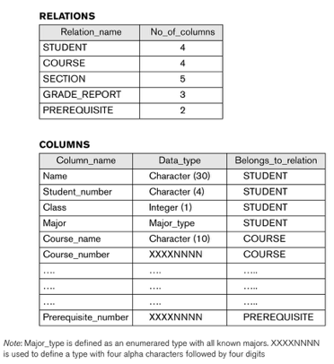

# CSCI 360 Spring 2020

# Topic 0: SQL vs. NO-SQL

[SQL vs NoSQL: What's the difference?](https://www.guru99.com/sql-vs-nosql.html)

## What is SQL?
+ Structured Query language (SQL) pronounced as "S-Q-L" or sometimes as "See-Quel" is the standard language for dealing with Relational Databases. A relational database defines relationships in the form of tables.
+ Relational databases like MySQL Database, Oracle, Ms SQL Server, Sybase, etc. use SQL

## What is NoSQL?
+ NoSQL database stands for "Not Only SQL" or "Not SQL."
+ NoSQL is a non-relational DMS, that does not require a fixed schema, avoids joins, and is easy to scale. NoSQL database is used for distributed data stores with humongous data storage needs. NoSQL is used for Big data and real-time web apps. For example companies like Twitter, Facebook, Google that collect terabytes of user data every single day.
+ A NoSQL database system encompasses a wide range of database technologies that can store structured, semi-structured, unstructured and polymorphic data.

# Topic 1: Databases and Database Users

## OUTLINE
+ Types of Databases and Database Applications
+ Basic Definitions
+ Typical DBMS Functionality
+ Example of a Database (UNIVERSITY)
+ Main Characteristics of the Database Approach
+ Types of Database Users
+ Advantages of Using the Database Approach
+ Historical Development of Database Technology
+ Extending Database Capabilities
+ When Not to Use Databases

## Types of Databases and Database Applications
+ Traditional Applications:
  - Numeric and Textual Databases
+ More Recent Applications:
  - Multimedia Databases
  - Geographic Information Systems (GIS)
  - Biological and Genome Databases
  - Data Warehouses
  - Mobile databases
  - Real-time and Active Databases
+ First part of book focuses on traditional applications
+ A number of recent applications are described later in the book (for example, Chapters 24,25,26,27,28,29)

### Recent Developments
+ Social Networks started capturing a lot of information about people and about communications among people-posts, tweets, photos, videos in systems such as:
  - Facebook
  - Twitter
  - Linked-In
+ All of the above constitutes data
+ Search Engines- Google, Bing, Yahoo : collect their own repository of web pages for searching purposes
+ New Technologies are emerging from the so-called non-database software vendors to manage vast amounts of data generated on the web:

+ Big Data storage systems involving large clusters of distributed computers (Chapter 25)
+ NOSQL (Not Only SQL) systems (Chapter 24)
+ A large amount of data now resides on the “cloud” which means it is in huge data centers using thousands of machines.
### Impact of Databases and Database Technology
+ Businesses: Banking, Insurance, Retail, Transportation, Healthcare, Manufacturing
+ Service Industries: Financial, Real-estate, Legal, Electronic Commerce, Small businesses
+ Education : Resources for content and Delivery
+ More recently: Social Networks, Environmental and Scientific Applications, Medicine and Genetics
+ Personalized Applications: based on smart mobile devices
## Basic Definitions
+ **Database**:
  - A collection of related data.
+ **Data**:
  - Known facts that can be recorded and have an implicit meaning.
+ **Mini-world**:
  - Some part of the real world about which data is stored in a database. For example, student grades and transcripts at a university.
+ **Database Management System (DBMS)**:
  - A software package/ system to facilitate the creation and maintenance of a computerized database.
+ **Database System**:
  - The DBMS software together with the data itself.  Sometimes, the applications are also included.
  

### Simplified database system environment

## Typical DBMS Functionality
+ Define a particular database in terms of its data types, structures, and constraints
+ Construct or Load the initial database contents on a secondary storage medium
+ Manipulating the database:
  - Retrieval: Querying, generating reports
  - Modification: Insertions, deletions and updates to its content
  - Accessing the database through Web applications
+ Processing and Sharing by a set of concurrent users and application programs – yet, keeping all data valid and consistent
### Application Activities Against a Database
+ Applications interact with a database by generating
  - Queries: that access different parts of data and formulate the result of a request
  - Transactions: that may read some data and “update” certain values or generate new data and store that in the database
+ Applications must not allow unauthorized users to access data
+ Applications must keep up with changing user requirements against the database
### Additional DBMS Functionality
DBMS may additionally provide:
+ Protection or Security measures to prevent unauthorized access
+ “Active” processing to take internal actions on data
+ Presentation and Visualization of data
+ Maintenance of the database and associated programs over the lifetime of the database application
  - Called database, software, and system maintenance
## Example of a Database (UNIVERSITY)
### Example of a Database (with a Conceptual Data Model)
+ Mini-world for the example:
  - Part of a UNIVERSITY environment.
+ Some mini-world entities:
  - STUDENTs
  - COURSEs
  - SECTIONs (of COURSEs)
  - (academic) DEPARTMENTs
  - INSTRUCTORs
+ Some mini-world relationships:
  - SECTIONs are of specific COURSEs
  - STUDENTs take SECTIONs
  - COURSEs have  prerequisite COURSEs
  - INSTRUCTORs teach  SECTIONs
  - COURSEs are offered by  DEPARTMENTs
  - STUDENTs major in  DEPARTMENTs

+ Note: The above entities and relationships are typically expressed in a conceptual data model, such as the ENTITY-RELATIONSHIP data model (see Chapters 3, 4)

## Main Characteristics of the Database Approach

Example of a simplified database catalog

+ Self-describing nature of a database system:
  - A DBMS **catalog** stores the description of a particular database (e.g. data structures, types, and constraints)
  - The description is called **meta-data**.
  - This allows the DBMS software to work with different database applications.
 -----------------------------------------------------------------------------
  - **Note**: Some newer systems such as a few NOSQL systems need no meta-data: they store the data definition within its structure making it self describing

+ Insulation between programs and data:
  - Called **program-data independence**.
  - Allows changing data structures and storage organization without having to change the DBMS access programs.

+ Data Abstraction: 
  - A **data model** is used to hide storage details and present the users with a conceptual view  of the database.
  - Programs refer to the data model constructs rather than data storage details
+ Support of multiple views of the data:
  - Each user may see a different view of the database, which describes only the data of interest to that user.
+ Sharing of data and multi-user transaction processing:
  - Allowing a set of concurrent users to retrieve from and to update the database.
  - Concurrency control within the DBMS guarantees that each transaction is correctly executed or aborted
  - Recovery subsystem ensures each completed transaction has its effect permanently recorded in the database
  - OLTP (Online Transaction Processing) is a major part of database applications. This allows hundreds of concurrent transactions to execute per second.
## Types of Database Users
+ Users may be divided into
  - Those who actually use and control the database content, and those who design, develop and maintain database applications (called “Actors on the Scene”), and
  - Those who design and develop the DBMS software and related tools, and the computer systems operators (called “Workers Behind the Scene”).
### Database Users – Actors on the Scene 
+ Actors on the scene
  - Database administrators:
    + Responsible for authorizing access to the database, for coordinating and monitoring its use, acquiring software and hardware resources, controlling its use and monitoring efficiency of operations.
  - Database Designers:
    + Responsible to define the content, the structure, the constraints, and functions or transactions against the database. They must communicate with the end-users and understand their needs.
  - Database End Users
    + They use the data for queries, reports and some of them update the database content. End-users can be categorized into:
      - Casual: access database occasionally when needed
      - Naïve or Parametric: they make up a large section of the end-user population.
        + They use previously well-defined functions in the form of  “canned transactions” against the database.
        + Users of Mobile Apps mostly fall in this category
        + Bank-tellers or reservation clerks are parametric users who do this activity for an entire shift of operations.
        + Social Media Users post and read information from websites
      - Sophisticated:
        + These include business analysts, scientists, engineers, others thoroughly familiar with the system capabilities.
        + Many use tools in the form of software packages that work closely with the stored database.
      - Stand-alone:
        + Mostly maintain personal databases using ready-to-use packaged applications.
        + An example is the user of a tax program that creates its own internal database.
        + Another example is a user that maintains a database of personal photos and videos.
  - **System Analysts and Application Developers** (This category currently accounts for a very large proportion of the IT work force.)
    + **System Analysts**: They understand the user requirements of naïve and sophisticated users and design applications including canned  transactions to meet those requirements. 
    + **Application Programmers**: Implement the specifications developed by analysts and test and debug them before deployment.
    + **Business Analysts**: There is an increasing need for such people who can analyze vast amounts of business data and real-time data (“Big Data”) for better decision making related to planning, advertising, marketing etc. 
### Database Users – Actors behind the Scene 
+ Actors behind the Scene 
  - **System Designers and Implementors**: Design and implement DBMS packages in the form of modules and interfaces and test and debug them. The DBMS must interface with applications, language compilers, operating system components, etc.
  - **Tool Developers**: Design and implement software systems called  tools for modeling and designing databases, performance monitoring, prototyping, test data generation, user interface creation, simulation etc. that facilitate building of applications and allow using database effectively.  
  - **Operators and Maintenance Personnel**: They manage the actual running and maintenance of the database system hardware and software environment.

## Advantages of Using the Database Approach
+ Controlling redundancy in data storage and in development and maintenance efforts.
  - Sharing of data among multiple users.
+ Restricting unauthorized access to data. Only the DBA staff uses privileged commands and facilities.
+ Providing persistent storage for program Objects
  - E.g., Object-oriented DBMSs make program objects persistent– see Chapter 12.
+ Providing Storage Structures (e.g. indexes) for efficient Query Processing – see Chapter 17.
+ Providing optimization of queries for efficient processing.
+ Providing backup and recovery services.
+ Providing multiple interfaces to different classes of users.
+ Representing complex relationships among data.
+ Enforcing integrity constraints on the database.
Drawing inferences and actions from the stored data using deductive and active rules and triggers.

### Additional Implications of Using the Database Approach
+ Potential for enforcing standards:
  - This is very crucial for the success of database applications in large organizations. Standards refer to data item names, display formats, screens, report structures, meta-data (description of data), Web page layouts, etc.
+ Reduced application development time:
  - Incremental time to add each new application is reduced.
+ Flexibility to change data structures:
  - Database structure may evolve as new requirements are defined. 
+ Availability of current information:
  - Extremely important for on-line transaction systems such as shopping, airline, hotel, car reservations.
+ Economies of scale:
  - Wasteful overlap of resources and personnel can be avoided by consolidating data and applications across departments.
## Historical Development of Database Technology
+ Early Database Applications:
  - The Hierarchical and Network Models were introduced in mid 1960s and dominated during the seventies.
  - A bulk of the worldwide database processing still occurs using these models, particularly, the hierarchical model using IBM’s IMS system.
+ Relational Model based Systems:
  - Relational model was originally introduced in 1970, was heavily researched and experimented within IBM Research and several universities.
  - Relational DBMS Products emerged in the early 1980s.
+ Object-oriented and emerging applications:
  - Object-Oriented Database Management Systems (OODBMSs) were introduced in late 1980s and early 1990s to cater to the need of complex data processing in CAD and other applications.
    + Their use has not taken off much.
  - Many relational DBMSs have incorporated object database concepts, leading to a new category called object-relational DBMSs (ORDBMSs)
  - Extended relational systems add further capabilities (e.g. for multimedia data, text, XML, and other data types)
+ Data on the Web and E-commerce Applications:
  - Web contains data in HTML (Hypertext markup language) with links among pages.
  - This has given rise to a new set of applications and E-commerce is using new standards like XML (eXtended  Markup Language). (see Ch. 13).
  - Script programming languages such as PHP and JavaScript allow generation of dynamic Web pages that are partially generated from a database (see Ch. 11).
    + Also allow database updates through Web pages
## Extending Database Capabilities
+ New functionality is being added to DBMSs in the following areas:
  - Scientific Applications – Physics, Chemistry, Biology - Genetics
  - Earth and Atmospheric Sciences and Astronomy
  - XML (eXtensible Markup Language)
  - Image Storage and Management
  - Audio and Video Data Management
  - Data Warehousing and Data Mining – a very major area for future development using new technologies (see Chapters 28-29)
  - Spatial Data Management and Location Based Services
  - Time Series and Historical Data Management
+ The above gives rise to new research and development in incorporating new data types, complex data structures, new operations and storage and indexing schemes in database systems.
+ Background since the advent of the  21st Century:

  - First decade of the 21st century has seen tremendous growth in user generated data and automatically collected data from applications and search engines.

  - Social Media platforms such as Facebook and Twitter are generating millions of transactions a day and businesses are interested to tap into this data to “understand” the users

  - Cloud Storage and Backup is making unlimited amount of storage available to users and applications
+ Emergence of Big Data Technologies and NOSQL databases
  - New data storage, management and analysis technology was necessary to deal with the onslaught of data in petabytes a day (1015 bytes or 1000 terabytes) in some applications – this started being commonly called as “Big Data”.
  - Hadoop (which originated from Yahoo) and Mapreduce Programming approach to distributed data processing (which originated from Google) as well as the Google file system have given rise to Big Data technologies (Chapter 25). Further enhancements are taking place in the form of Spark based technology.
  - NOSQL (Not Only SQL- where SQL is the de facto standard language for relational DBMSs) systems have been designed for rapid search and retrieval from documents, processing of huge graphs occurring on social networks, and other forms of unstructured data with flexible models of transaction processing (Chapter 24). 
## When Not to Use Databases
+ Main inhibitors (costs) of using a DBMS:
  - High initial investment and possible need for additional hardware.
  - Overhead for providing generality, security, concurrency control, recovery, and  integrity functions.
+ When a DBMS may be unnecessary:
  - If the database and applications are simple, well defined, and not expected to change.
  - If access to data by multiple users is not required.
+ When a DBMS may be infeasible:
  - In embedded systems where a general purpose DBMS may not fit in available storage
+ When no DBMS may suffice:
  - If there are stringent real-time requirements that may not be met because of DBMS overhead (e.g., telephone switching systems)
  - If the database system is not able to handle the complexity of data because of modeling limitations (e.g., in complex genome and protein databases)
  - If the database users need special operations not supported by the DBMS (e.g., GIS and location based services).
